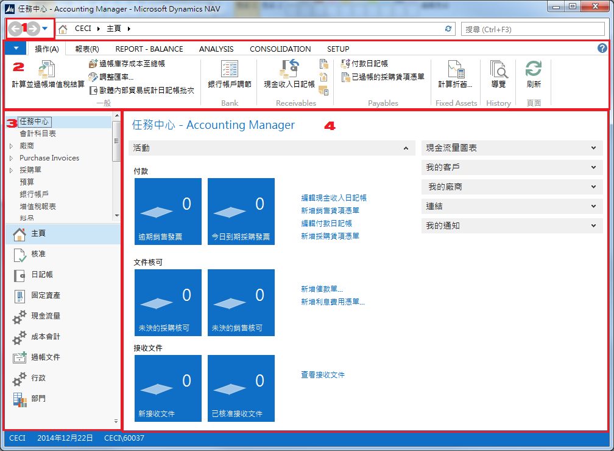

# 使用者介面介紹
本章介紹NAV最基本的使用者介面，依下圖將畫面分為4個區域，分別為：

###### 1. 前進/後退按鈕 (Back and Forward buttons)
與網頁瀏覽器中常見的功能一樣，使用者可以在已經使用過的頁面中移動。

###### 2.功能表區 (Ribbon)
配合所呈現的頁面，放置使用者需要使用到的各種作業選項按鈕。

###### 3. 導航面板 (Navigation Pane)
以選擇表 (Menu) 的方式將系統的主要功能模組列表置於本區塊。

###### 4. 內容區 (Content Area)
使用者工作的區域，顯示使用者作業所需的相關資料。
