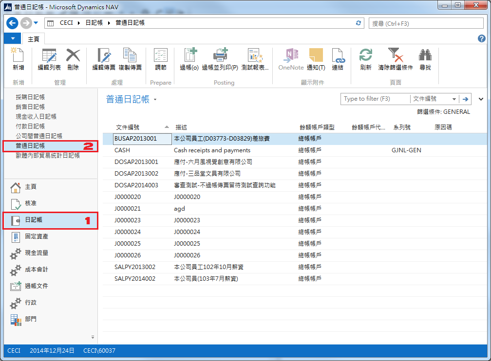
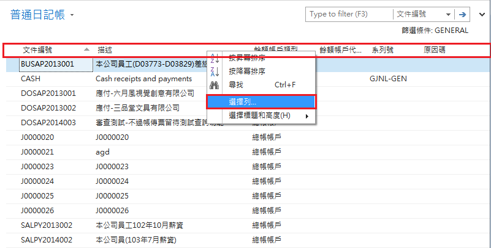
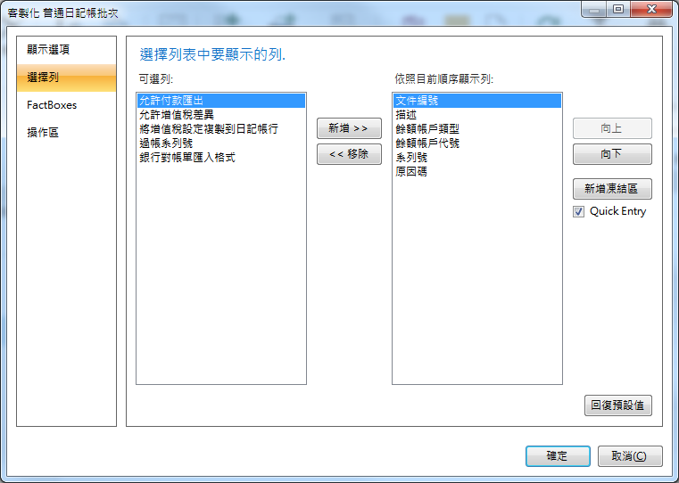
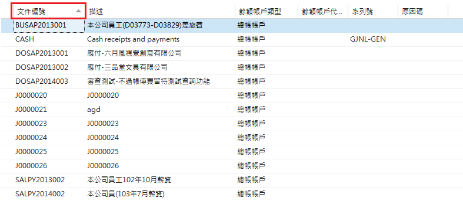

# 一般基本操作

普通日記帳為所有未過帳的傳票，無論是外部系統透過抛轉進來的，或者是由會計手開的傳票皆會陳列在此畫面。

###### 一、瀏覽普通日記帳

1. 按下導航面板 (Navigation Pane) 中的『日記帳』。
2. 再點選上方的『普通日記帳』。

###### 二、變更顯示欄位

1. 將滑鼠移到標題列，按下滑鼠右鍵。
2. 點選『選擇列』。
3. 將不要顯示的欄位移除；或將要顯示的欄位新增。

###### 三、排序
點選你要依據的欄位標題列，系統會自動依你所點選的標題列作為排序的欄位；排序欄位旁會有一個三角形表示其為Asc或Desc。

