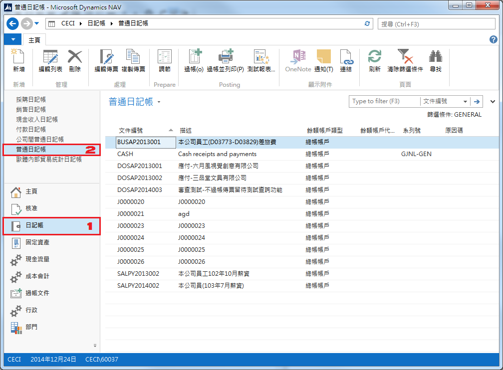
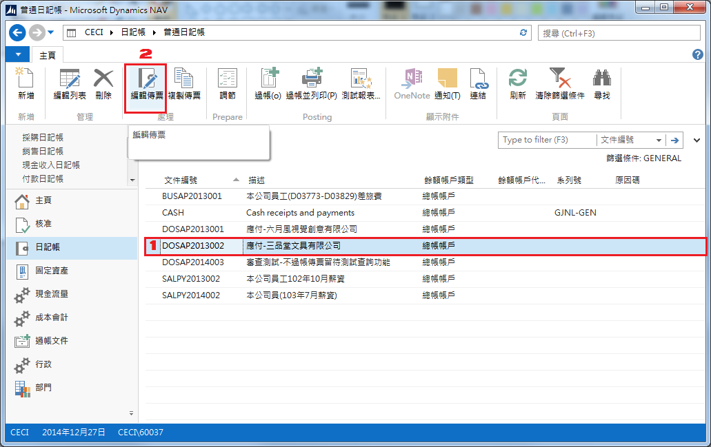
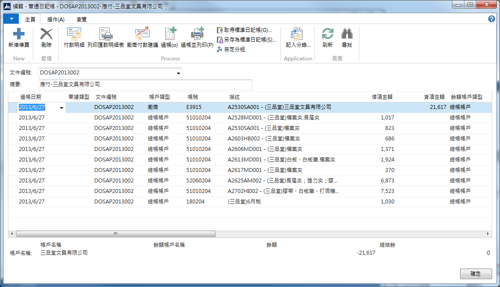

# 日記帳操作

普通日記帳為所有未過帳的傳票，無論是外部系統透過抛轉進來的，或者是由會計手開的傳票皆會陳列在此畫面。

###### 一、瀏覽普通日記帳

1. 按下導航面板 (Navigation Pane) 中的『日記帳』。
2. 再點選上方的『普通日記帳』。
3. 內容區會列出**未過帳**的傳票清單。

###### 二、檢查抛轉的日記帳

1. 選擇你要瀏覽編輯的日記帳。
2. 按下功能列表 (Ribbon) 上的『編輯傳票』按鈕。
3. 系統會另開啟視窗顯示該日記帳的內容，如下圖：

