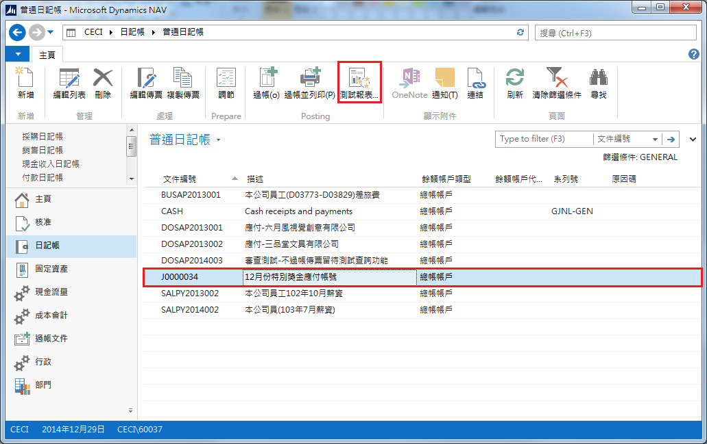
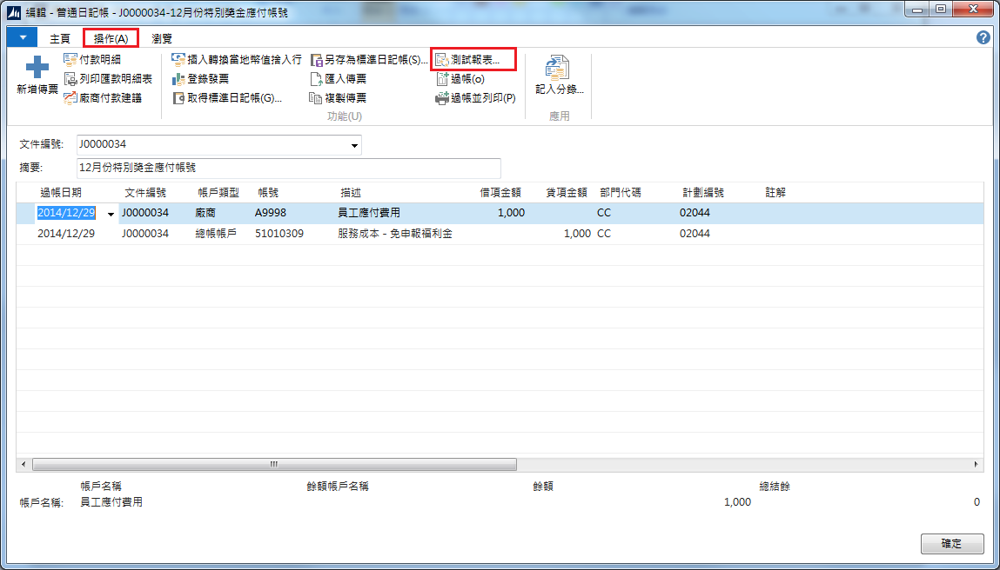
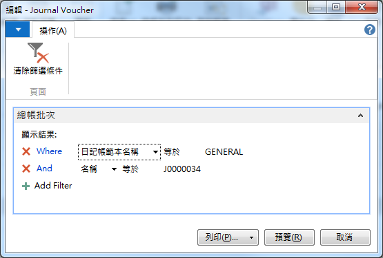
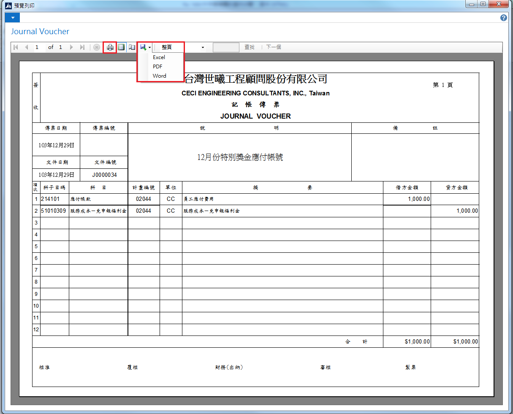

# 列印傳票（未過帳）

列印未過帳傳票有兩種，分別為在傳票清單及檢視編輯傳票細項時都有列印按鈕。

1. 列印方法一：進入普通日記帳清單畫面，點選要列印的傳票，按下上方『測試報表』按鈕（**按鈕名稱在上線前會更改**）。

2. 列印方二：進入檢視傳票細項的畫面，選擇功能表區 (Ribbon) 中的『操作』，點選『測試報表』按鈕（**按鈕名稱在上線前會更改**）。

3. 無論透過那個方法列印傳票，系統皆會出現以下畫面詢問使用者。可按下『列印』按鈕直接列印；或者按下『預覽列印』進入預覽模式。

4. 進入預覽列模式後，可選擇列印圖示列印傳票；或匯出成Excel、PDF、Word格式。

