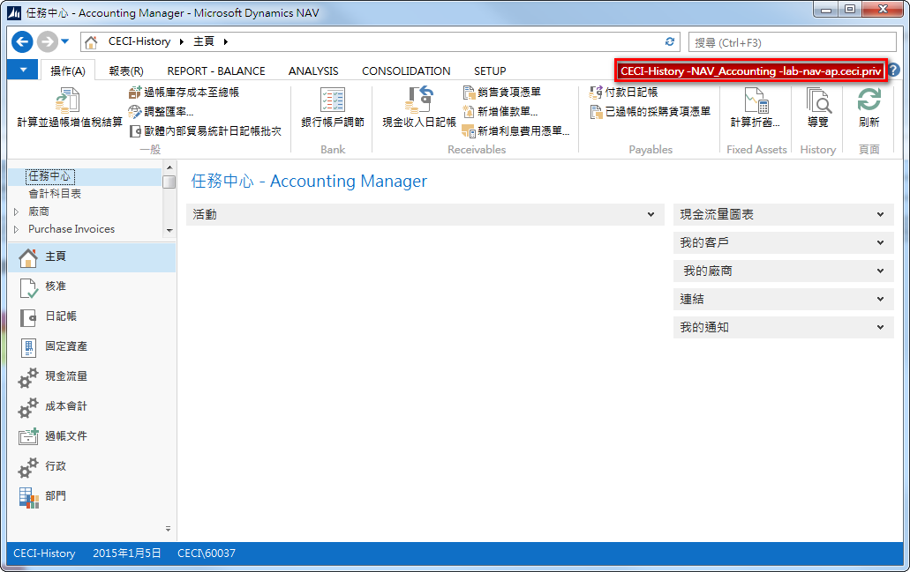
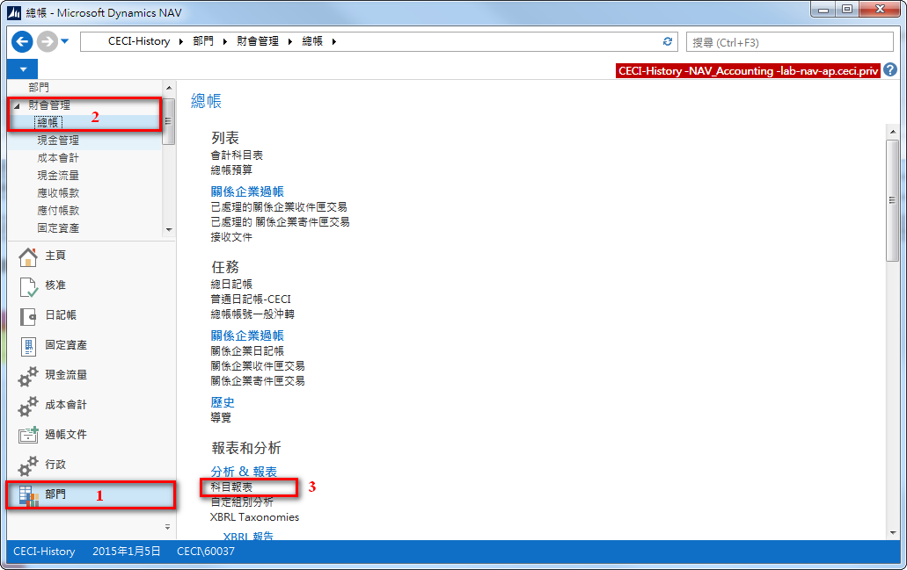
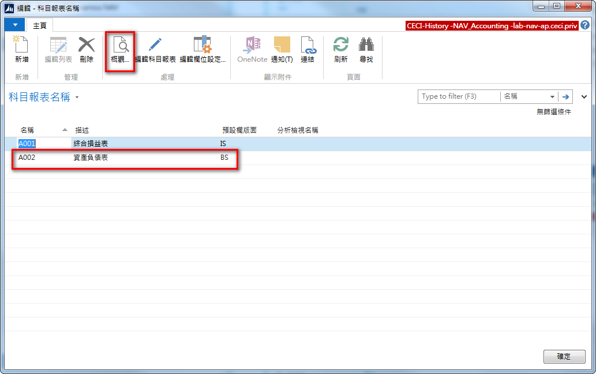
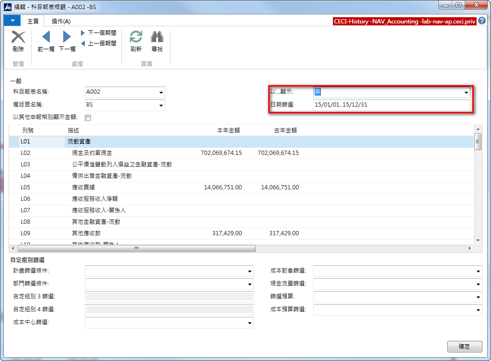
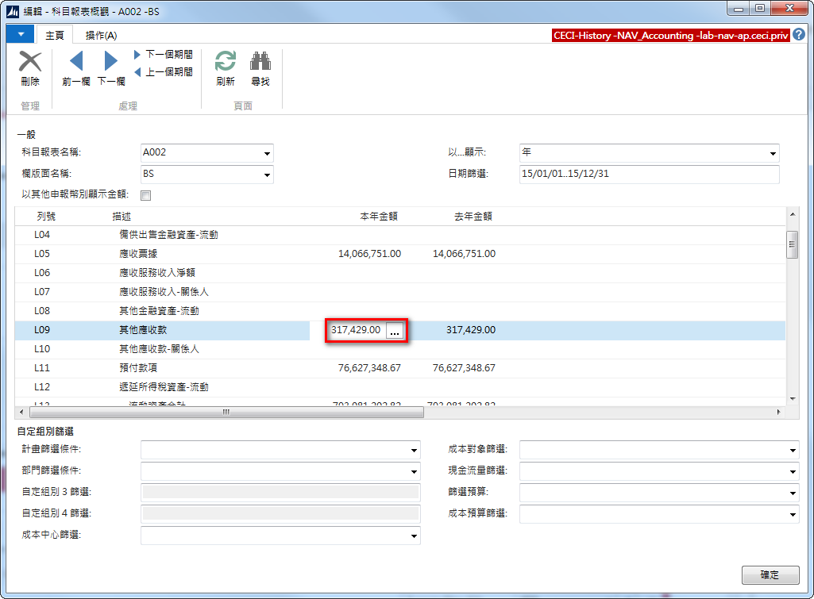
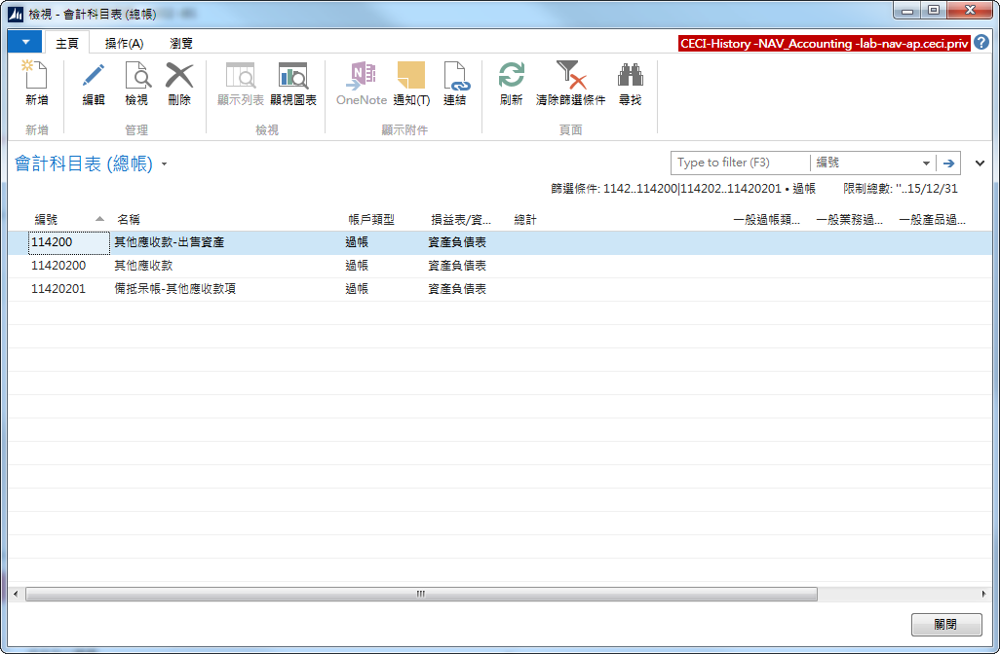

# 資產負債表

1. 先依下圖檢查是否選擇了報表專用公司 CECI-History，如果不是請依此 [**連結**](Report.md) 選擇CECI-History

2. 依序點選導航面板 (Navigation Pane)上的「部門」\「財會管理」\「總帳」；再點選內容區的『科目報表』

3. 系統開啟科目報表視窗，先選擇「資產負債表」，再點選上方『概觀...』按鈕。

4. 系統開啟該報表視窗，依下圖調整「以...顯示」為年；輸入「日期篩選」，例如:10/01/01..10/12/31表示民國99年全年度.

5. 如需進一步檢視報表數字可點選該數字，點選數字旁的「...」

6. 系統會帶出該數字的資料明細

