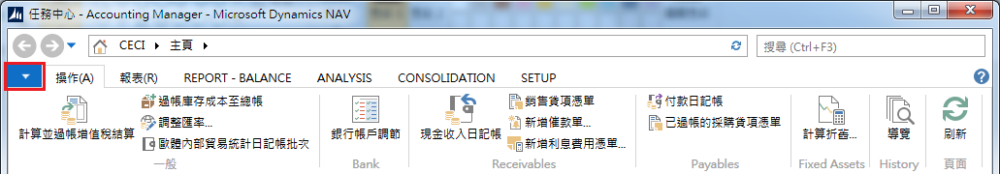
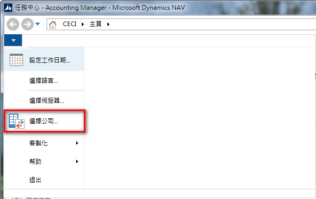
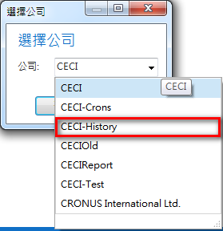
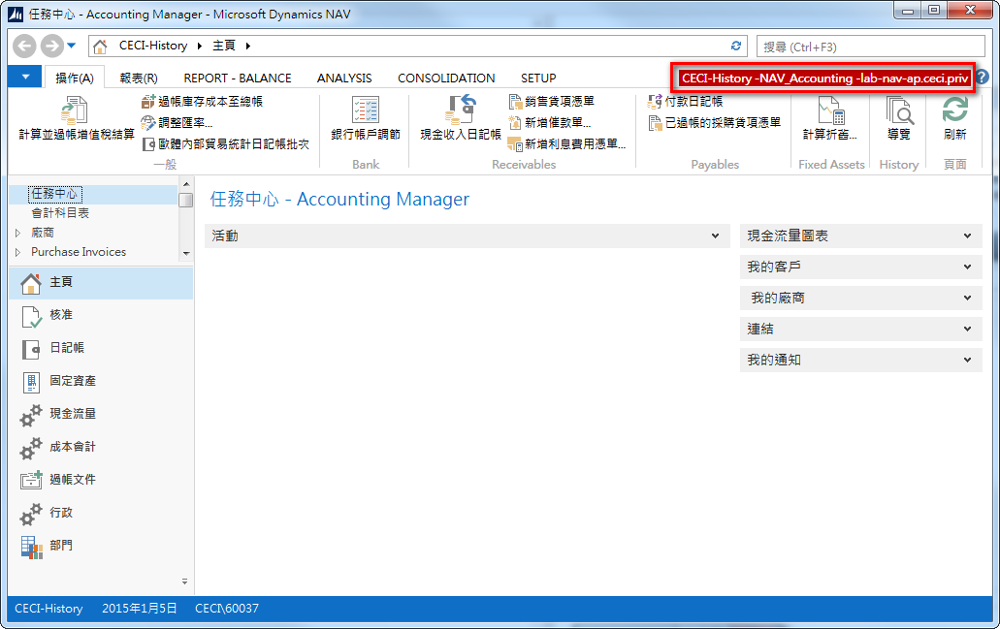

# 報表作業

為了不要將一般練習區與報表驗證的資料混淆，特在整合測試環境開立多個公司，其中專供報表資料驗證的公司為 CECI-History。

1. 進入系統後點選畫面左上方的小小三角形，如下圖所示：

2. 點選小小三角形後，系統會展開功能表，選擇『選擇公司...』

3. 系統跳出選擇公司小視窗，選擇『CECI-History』 

4. 系統會自動重新啟動，重啟後在系統的右側會顯示目前你選擇的公司，請檢查你選擇是否是 CECI-History

